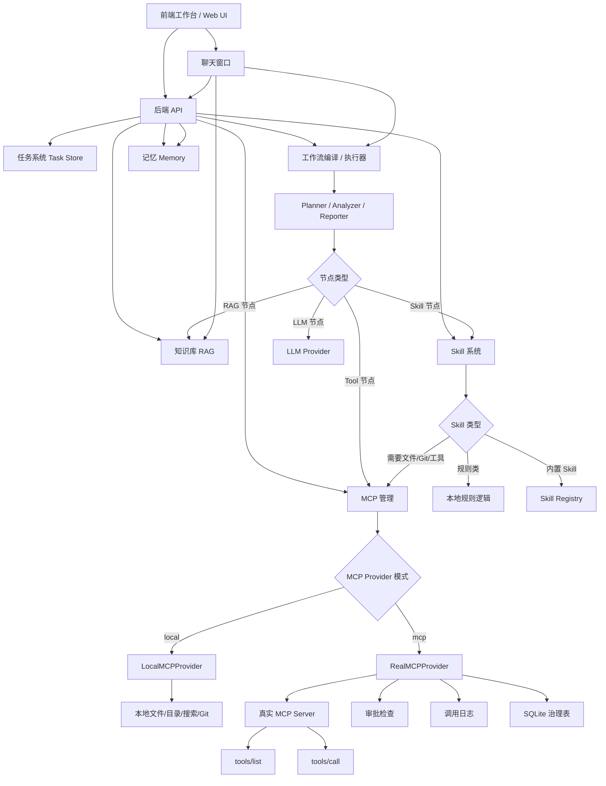

# Jaycode 架构讲解

> 这份文档只讲一件事：这个项目的整体架构是怎么组织的。
> 它不承担学习路线职责，学习顺序请看另一份手册。
>
> 当前部署注记（2026-09-17）：持久化层通过 `PersistenceStores` 接入 PostgreSQL `jayagent_studio`，并以同库 pgvector 承载 RAG；图中 SQLite 描述代表兼容/迁移来源，而不是当前权威运行库。

---

## 1. 架构目标

Jaycode 的目标不是做一个普通聊天界面，而是搭建一个 **面向软件项目理解与工程治理的多 Agent 平台**。

这个平台要解决的问题包括：

- 如何扫描和理解一个代码项目
- 如何对代码做规则审查和语义审查
- 如何把项目知识沉淀进 RAG
- 如何把多 Agent 协作流程编排起来
- 如何让工作流可视化、可执行、可恢复
- 如何让任务执行过程可追踪、可审计、可回放
- 如何把 Skill、MCP、LLM、前端统一进一个系统

所以它的架构不是单一的“API + 页面”，而是一个分层协作系统。

---

## 2. 总体分层

项目可以拆成 6 层：

```text
前端工作台
  -> API 门户层
  -> 任务治理层
  -> Agent / Graph 编排层
  -> 持久化与能力层
  -> 外部模型与工具层
```

更具体一点：

```text
React Web
  -> FastAPI Routes
  -> Harness Runtime
  -> LangGraph / Skills / Workflows
  -> SQLite / RAG / Memory / Marketplace
  -> LLM / MCP / Docker Sandbox
```

### 2.1 为什么要这样分层

因为 Agent 项目最容易失败的地方不是“不会调用模型”，而是：

- 逻辑混在一起
- 状态散落在各处
- 任务没有统一上下文
- 没有事件记录和恢复点
- 能力没有权限边界
- 前端和后端数据结构不统一

Jaycode 用分层把这些问题拆开了。

---

## 3. 前端工作台层

前端主要在 `web/` 目录。

### 3.1 核心入口

- `web/src/App.tsx`
- `web/src/api.ts`
- `web/src/types.ts`

### 3.2 前端承担什么职责

前端不是简单展示结果，而是整个系统的控制台，负责：

- 提交任务
- 配置工作流
- 查看分析结果
- 查看任务事件
- 处理人工审核
- 查看模型调用
- 管理 MCP
- 管理 Skills
- 浏览 Marketplace
- 查看 Benchmark

### 3.3 前端架构特点

前端采用单页工作台的方式，把多个业务页统一在一个界面里。

这意味着它不是一个“结果页”，而是一个“操作台”：

- `run`：运行任务
- `workflow`：编排工作流
- `reports`：查看报告
- `chat`：追问和对话
- `history`：任务历史
- `llm`：模型治理
- `mcp`：工具治理
- `skills`：技能管理
- `marketplace`：插件市场
- `benchmark`：评测面板

### 3.4 架构意义

这一层让项目从“后端能力集合”变成“可用产品”。

---

## 4. API 门户层

核心文件是 `app/api/routes.py`。

### 4.1 它的职责

API 层是整个系统对外暴露能力的唯一入口之一。

它负责把底层复杂能力统一成标准 HTTP 接口：

- 项目分析
- 代码审查
- RAG 处理与查询
- 学习计划生成
- 任务执行与追问
- 工作流保存、校验、运行
- 人工审核
- Skill 执行
- MCP 管理
- Benchmark 评测

### 4.2 为什么要集中在这里

如果这些接口分散到很多地方，前端、脚本、测试和外部调用都会变复杂。

统一 API 门户的好处是：

- 调用路径清晰
- 返回结构统一
- 便于鉴权和审计
- 便于前端接入
- 便于后续扩展

### 4.3 架构位置

API 层是承上启下的一层：

- 向上接收前端和外部请求
- 向下调用任务治理层和图编排层

---

## 5. 任务治理层

核心文件是 `app/harness/runtime.py`。

### 5.1 它解决什么问题

Agent 运行不是一次函数调用，而是一段要被治理的流程。

治理层负责：

- 创建任务上下文
- 记录任务事件
- 调度图执行
- 提取最终报告
- 保存结果与审计产物
- 处理人工审核状态

### 5.2 这层的关键意义

如果没有治理层，系统会变成：

- 没有统一任务 ID
- 没有事件时间线
- 没有恢复点
- 没有任务状态管理
- 没有审计轨迹

Harness Runtime 把这些都补齐了。

### 5.3 架构位置

它位于 API 层和图编排层之间，是执行过程的“管理中枢”。

---

## 6. Agent 与 Graph 编排层

这一层是项目最核心的地方，主要由 `app/graphs/` 和 `app/agents/` 共同组成。

---

### 6.1 固定协作图

文件：`app/graphs/studio_graphs.py`

#### 职责

这个文件定义了几个预设的协作图：

- `code_review_graph`
- `rag_process_graph`
- `learning_coach_graph`
- `workflow_runner_graph`
- `collaboration_graph`

#### 结构

它把多个 Agent 节点组合成固定流程，例如：

```text
Planner
  -> Project Analyzer
  -> Code Reviewer
  -> RAG Processor
  -> Supervisor
  -> Human Review
  -> Reporter
```

#### 架构意义

这里体现的是“多 Agent 协同”而不是“单轮问答”。

---

### 6.2 动态工作流编排

文件：`app/graphs/workflow_compiler.py`

#### 职责

它负责把前端拖拽出来的工作流定义变成真正可执行的 LangGraph 图。

#### 核心内容

- `WorkflowState`：工作流共享状态
- 节点标准化
- 边标准化
- 结构校验
- 图编译
- 恢复执行
- 人工审核

#### 架构意义

这是项目里最典型的“配置驱动执行”设计。

它把前端上的图形结构，变成后端上的真实流程。

---

### 6.3 能力实现层

文件夹：`app/agents/`

#### 主要职责

这里不负责编排，只负责“具体能做什么”。

主要能力包括：

- `project_tools.py`
  - 项目扫描
  - 技术栈识别
  - 模块分析
  - API 线索提取
  - 风险与建议生成

- `code_review_tools.py`
  - 代码审查
  - 文件级规则扫描
  - 安全模式识别
  - 调用链分析
  - LLM 语义审查兜底

- `learning_tools.py`
  - 学习计划生成
  - 学习任务拆解

- `rag_tools.py`
  - 文档切分
  - 知识处理

- `collaboration_tools.py`
  - 协作结果汇总
  - Supervisor 结论整理

#### 架构意义

这一层是“业务能力库”，编排层只负责把这些能力串起来。

---

## 7. 持久化层

核心目录：`app/persistence/`

### 7.1 `sqlite_store.py`

负责任务、事件、附件、工作流快照等基础数据保存。

### 7.2 `rag_store.py`

负责知识库相关的数据：

- 文档入库
- 文档查询
- 版本管理
- Gold Case 评测
- ACL 控制

### 7.3 `memory_store.py`

负责长期记忆：

- 候选记忆
- 确认
- 冲突替换
- 过期
- 删除

### 7.4 架构意义

持久化层不是简单存文件，而是让系统具备：

- 可回放
- 可审计
- 可恢复
- 可治理

---

## 8. Skill 与 Marketplace 层

### 8.1 `app/skills/`

Skill 是项目的插件式能力单元。

典型职责：

- 定义 Skill 合约
- 注册 Skill
- 执行 Skill
- 沙箱隔离
- builtin Skill 管理

### 8.2 `app/marketplace/`

Marketplace 负责插件资源包的安装、预览、卸载和管理。

### 8.3 架构意义

这一层让系统从“写死的 Agent 程序”升级为“可扩展的平台”。

---

## 9. 外部工具与模型层

### 9.1 `app/providers/llm_provider.py`

统一封装模型调用、fallback、trace 和提示词配置。

### 9.2 `app/providers/mcp_provider.py`

统一封装 MCP 工具的注册、发现、调用与审批。

### 9.3 架构意义

这两个 provider 层的作用是把外部能力收口，避免业务代码到处直接依赖第三方接口。

---

## 10. 前后端交互关系

前端和后端的关系不是简单的“页面调用接口”，而是：

```text
前端工作台
  -> API 门户
  -> 任务治理
  -> 图编排 / 能力执行
  -> 持久化 / 审计
  -> 前端展示结果
```

这意味着一个任务不仅会返回结果，还会返回：

- 事件流
- 报告
- 审核信息
- 恢复点
- 工作流结果
- Benchmark 数据

---

## 11. 数据流视角

一个典型请求的流转大致是：

```text
用户提交请求
  -> FastAPI 接收
  -> 创建任务上下文
  -> 调用图或能力模块
  -> 记录事件
  -> 生成结果
  -> 保存任务和治理产物
  -> 返回前端
```

如果是工作流类任务，还会多一步：

```text
前端定义节点和边
  -> 后端校验结构
  -> 编译成 LangGraph
  -> 执行并支持恢复
```

---

## 12. 这套架构最值得学的地方

如果你只想抓住这个项目最关键的架构思想，我建议看这 5 点：

1. **把 Agent 能力和编排逻辑分离**
2. **把任务执行做成可治理流程**
3. **把动态工作流做成可执行图**
4. **把知识库和长期记忆分开管理**
5. **把前端、API、模型、工具统一进一个工作台**

---

## 13. 学习结论

Jaycode 不是一个单点 demo，而是一个完整的 Agent 平台骨架。

它的架构价值主要体现在：

- 有明确分层
- 有任务治理
- 有多 Agent 协作
- 有动态工作流
- 有持久化和审计
- 有插件和工具扩展
- 有前端工作台和评测系统


